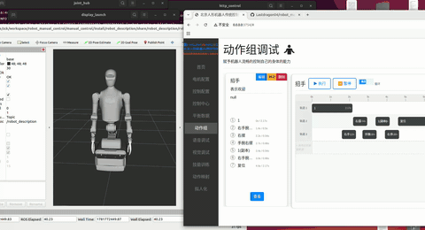

<p align="left">
    中文&nbsp ｜ &nbsp<a href="README_EN.md">English</a>
</p>
<br>

<p align="center">
  <strong>HTTP-to-ROS2 机器人控制平台</strong>
</p>

<p align="center">
  基于 ROS2 Humble 与 FastAPI 的人形机器人 Web 远程控制中间件
</p>

<p align="center">
  
  
  
  
  
</p>

---

## 项目定位

**核心目的**: 方便调试机器人——提供一个通用的 Web 控制台，让开发者可以远程实时操控和调试各种机器人，降低调试门槛。

**最终愿景**: 适配市面上所有机器人，成为通用机器人控制中间件，而非仅限特定型号。

**当前阶段**: 已支持天工2.0Plus、天工2.0Pro、天轶2.0Pro 系列机器人，提供从底层电机调试、动作编排录制到步态训练的完整工具链。

## 技术栈

| 层级 | 技术 |
|------|------|
| 机器人框架 | ROS2 Humble, `bodyctrl_msgs`, `sensor_msgs` |
| 后端 | FastAPI + uvicorn (HTTP :3754) |
| 数据库 | SQLite (WAL模式)，原生 `sqlite3` 模块（SQLAlchemy ORM 已废弃） |
| 前端 | jQuery 3.7 + Bootstrap 4.6 + ECharts 5 (SPA, `dist/`) |
| 科学计算 | NumPy, Matplotlib |
| URDF | 天工2.0Pro / 天轶2.0Pro 完整URDF模型 |

## 系统架构（四层）

```
┌──────────────────────────────────────────────────┐
│            Claude (AI 助手)                        │
│  通过 MCP 协议直接控制机器人                        │
│  • 自然语言 → 动作组执行                           │
│  • 每个动作组自动映射为 MCP Tool                   │
└────────────────────┬─────────────────────────────┘
                     │ MCP (stdio JSON-RPC)
┌────────────────────▼─────────────────────────────┐
│          mcp_control (ROS2 Node)                   │
│  MCP→HTTP 代理，将 AI 指令转发给 http_control      │
│  • 启动时从数据库加载动作组 → MCP Tools            │
│  • 委托 http_control 执行，不重复造轮子            │
└────────────────────┬─────────────────────────────┘
                     │ HTTP REST
┌────────────────────▼─────────────────────────────┐
│               Browser (SPA)                       │
│  jQuery + Bootstrap 4 + ECharts + WebSocket       │
│  • 实时电机控制  • 时间轴动作编排  • IMU可视化     │
└────────────────────┬─────────────────────────────┘
                     │ HTTP REST + WebSocket
┌────────────────────▼─────────────────────────────┐
│           robot_control (ROS2 Node)               │
│  FastAPI + uvicorn (port 3754)                    │
│  • REST API — 电机/控制器/动作组 CRUD             │
│  • ROS2 Publishers →                              │
│    /head/cmd_pos, /arm/cmd_pos,                   │
│    /waist/cmd_pos, /leg/cmd_pos,                  │
│    /inspire_hand/ctrl/{left,right}_hand           │
└────────────────────┬─────────────────────────────┘
                     │ ROS2 Topic
┌────────────────────▼─────────────────────────────┐
│          joint_description (ROS2 Node)             │
│  JointHub — 关节状态管理中心                       │
│  • 订阅控制指令，插值平滑运动                       │
│  • 20Hz 发布 /joint_states                        │
│  • 支持 RViz 可视化                               │
└────────────────────┬─────────────────────────────┘
                     │
┌────────────────────▼─────────────────────────────┐
│               SQLite (WAL Mode)                    │
│  robot / motor_config / control_config            │
│  action_groups / action / words                   │
└──────────────────────────────────────────────────┘
```

## 演示

Web 控制台点击执行动作组，RViz 中机器人实时响应：



## 核心功能

### 1. 实时电机控制与协同控制 ★

- 按身体部位分组（头/臂/腰/腿/灵巧手），每路独立控制
- **协同控制**：主节点提供输入值 x，从节点通过多项式 f(x) 自动计算目标位置，实现多关节联动
- 三环参数可调：位置 (pos)、速度 (spd)、电流 (cur)
- 电机在线状态指示灯，WebSocket 实时推送
- 支持多电机同时选中、批量执行与归零

### 2. 时间轴动作编排引擎 ★ 2026/06 重构

- **多轨道并行**：不同动作可分配不同轨道（track），并行执行
- **拖拽编辑**：动作块可拖拽移动、右边缘缩放时长、拖到空白自动建轨
- **断点执行**：点击标尺设置断点，从指定位置开始播放
- **播放头**：`requestAnimationFrame` 驱动实时播放头，吸附引导线
- **Dirty 保存模式**：本地编辑 → 批量提交，未保存时按钮绿色脉冲提示
- 循环执行 / 单次执行，紧急停止

### 3. 电机配置管理

- 完整的电机参数 CRUD：CAN ID、协议类型、机械限位、默认位置
- 多项式拟合依赖（.pkl 文件），用于非标定关节的角度映射
- 支持多机器人类型动态切换（从 `/robot/get_all` 加载）

### 4. 控制器管理

- 独立控制 / 协同控制两种模式
- 协同主节点（虚拟节点，蓝色高亮）管理一组从节点
- 从节点自动缩进显示，不可独立操作
- .pkl 文件上传与管理

### 5. 动作组与语音知识库

- 动作组 CRUD + 执行/停止
- 语音指令 → 动作组映射 (`words` 表)
- 支持文本回答和动作组执行两种模式

### 6. MCP Server — Claude AI 控制机器人 ★

- **自动 Tool 映射**：启动时从数据库加载所有动作组，每个动作组自动注册为一个 MCP Tool（tool 名 = 动作组名，描述 = 动作组描述）
- **零硬编码**：新增/修改动作组无需改代码，Claude 自动感知
- **HTTP 代理模式**：`mcp_control` 不重复控制逻辑，通过 HTTP 委托 `http_control` 执行
- **机器人隔离**：通过 `robot_name` 参数指定机器人，仅暴露该机器人的动作组
- 支持循环执行 (`cycle`) 和断点起始 (`start_from`)

**启动**：
```bash
ros2 run mcp_control mcp_server --ros-args -p robot_name:=天工2.0Pro
```

**Claude Code 配置**：
```bash
claude mcp add robot -- ros2 run mcp_control mcp_server --ros-args -p robot_name:=天工2.0Pro
```

## 数据库核心表

### robot — 机器人型号
| id | name |
|----|------|
| 1  | 天工2.0Plus |
| 2  | 天工2.0Pro |
| 3  | 天轶2.0Pro |

### motor_config — 电机配置
| 列 | 说明 |
|----|------|
| motor_id | 板内电机ID（联合唯一键） |
| can_rx_id / can_tx_id | CAN 收发 ID |
| name | 电机名称 |
| protocol | 协议类型 (0=未选, 1=邱协议, 2=老丁协议, 3=步进协议) |
| current/max/min/default_position | 位置参数 |
| robot_id | 外键 → robot |

### control_config — 控制器 ★
| 列 | 说明 |
|----|------|
| name | 关节/控制器名称 |
| topic | ROS2 Topic |
| name_index | 关联 motor_config.motor_id |
| urdf_name | URDF 关节名 |
| **slave_id** | ★ NULL=独立, =自身id=主节点, =别人id=从节点 |
| reference_pkl | 多项式 .pkl 文件名 |

**协同控制模型**: 主节点提供 x → 从节点 i 通过 f_i(x) = y_i 计算输出位置。

### action_groups / action — 时间轴动作 ★ 2026/06 重构

| 表 | 关键列 | 说明 |
|----|--------|------|
| action_groups | name, description, callback, robot_id | 动作组 |
| action | track, start_time, duration, command(JSON) | 多轨道并行动作 |

**执行模型**: 按 start_time 排序，支持断点起始，服务端统一执行。

## REST API

<details>
<summary><b>电机管理</b> — 点击展开</summary>

| 方法 | 路径 | 说明 |
|------|------|------|
| GET | `/motor/get_all?robot_id=X` | 获取电机列表 |
| GET | `/motor/get_a_motor?motor_id=X` | 获取单个电机 |
| POST | `/motor/add` | 添加电机 |
| PUT | `/motor/modify` | 修改电机 |
| DELETE | `/motor/delete` | 删除电机 |

</details>

<details>
<summary><b>控制器管理</b> — 点击展开</summary>

| 方法 | 路径 | 说明 |
|------|------|------|
| GET | `/controller/get_all?robot_id=X` | 获取控制器列表 |
| GET | `/controller/get_motor_id?control_id=X` | 获取关联电机 + 从节点 |
| POST | `/controller/add` | 添加（支持协同控制） |
| PUT | `/controller/modify` | 修改 |
| DELETE | `/controller/delete` | 删除（主节点级联删从节点） |
| POST | `/controller/compute_slaves` | 计算从节点 f(x) |
| POST | `/controller/upload_pkl` | 上传 .pkl |

</details>

<details>
<summary><b>动作组 & 动作</b> — 点击展开</summary>

| 方法 | 路径 | 说明 |
|------|------|------|
| GET | `/action_group/get_all` | 获取所有动作组 |
| POST | `/action_group/add` | 创建动作组 |
| DELETE | `/action_group/delete` | 删除 |
| POST | `/action_group/run` | 时间轴执行 (cycle, start_from) |
| POST | `/action_group/stop` | 停止 |
| GET | `/action/get_all?group_id=X` | 获取时间轴数据 |
| POST | `/action/add` | 添加动作（自动推算 duration） |
| PUT | `/action/update` | 全量更新 |
| DELETE | `/action/delete` | 删除 |
| PUT | `/action/batch_save` | 批量保存（排序→重算→重编号→先删后插） |

</details>

<details>
<summary><b>电机控制 & 机器人</b> — 点击展开</summary>

| 方法 | 路径 | 说明 |
|------|------|------|
| GET | `/control/get_all?robot_id=X` | 获取控制中心数据 |
| POST | `/control/run` | 执行电机控制 |
| POST | `/control/init` | 选中电机归零 |
| POST | `/control/reset_current` | 复位电机电流 |
| GET | `/robot/get_all` | 获取所有机器人型号 |

</details>

## 快速开始

### 环境要求

- Ubuntu 22.04
- ROS2 Humble
- Python 3.10+

### 安装

```bash
# 1. 安装 Python 依赖
pip install -r requirement.txt

# 2. 编译 ROS2 工作空间
cd /path/to/http_to_ros
colcon build --symlink-install
source install/setup.bash
```

### 运行

```bash
cd /path/to/http_to_ros
export ROS_DOMAIN_ID=0
source install/setup.bash

# 启动 HTTP 控制服务 (含 ROS2 节点)
ros2 run robot_control http_control

# 可选：启动关节状态管理 (RViz 可视化)
ros2 run joint_description joint_hub

# 可选：启动 URDF 模型显示
ros2 launch robot_description display.launch.py
```

浏览器访问 `http://<机器人IP>:3754`

### ROS2 参数

| 参数 | 默认值 | 说明 |
|------|--------|------|
| `dist_path` | `/home/zck/workspace/http_to_ros/dist` | 前端文件路径 |
| `db_path` | `.../Memories/robot_control_v2.db` | SQLite 数据库路径 |
| `server_port` | 3754 | HTTP 服务端口 |
| `models_path` | `.../Models` | .pkl 多项式文件目录 |

### 机器人模式要求

- **天工2.0系列**：需切换至 `motion_control` 模式；支持分布式通信（网线）
- **天轶2.0系列**：需部署在机器人内部计算机（未配置DDS时）

## 目录结构

```
http_to_ros/
├── dist/                              # 前端 SPA
│   ├── index.html                     # 入口（所有页面单文件）
│   ├── js/apis.js                     # 核心业务逻辑
│   ├── js/script.js                   # UI事件、DOM交互
│   ├── js/voice.js                    # 语音控制
│   ├── css/styles.css                 # 自定义样式
│   └── bootstrap-4.6.2-dist/
├── Models/                            # .pkl 多项式文件存储
├── manual_control/src/
│   ├── robot_control/robot_control/   # 主控包
│   │   ├── http_control.py            # FastAPI + ROS2 入口
│   │   ├── bll.py                     # 业务逻辑
│   │   ├── schemas_models.py          # Pydantic 模型
│   │   └── db/crud.py                 # 数据访问层
│   ├── mcp_control/mcp_control/       # MCP Server（Claude AI 桥接）
│   │   └── mcp_server.py              # MCP→HTTP 代理
│   ├── joint_description/             # 关节状态管理
│   ├── robot_description/             # 机器人URDF + Launch(display.launch.py)
│   ├── tiangong2pro_urdf/             # 天工2.0Pro URDF
│   ├── tianyi2_urdf/                  # 天轶2.0Pro URDF
│   ├── bodyctrl_msgs/                 # 自定义ROS2消息包
│   ├── robot_interfaces/              # 机器人接口定义
│   ├── robot_msg/                     # 机器人消息类型
│   └── lite_urdf_publish/             # 轻量URDF发布
├── test/                              # 测试脚本
├── Memories/                          # SQLite 数据库文件
├── start.sh                           # 一键启动脚本
└── requirement.txt                    # Python 依赖
```

## 关键依赖

`fastapi` `uvicorn` `matplotlib` `jinja2` `python-multipart` `numpy` `pymysql`（未使用）

---

## 许可

本项目仅用于教育和研究目的。

## 联系方式

**作者**: zck  
**邮箱**: 1692930439@qq.com  
**电话**: +86 19987400216
